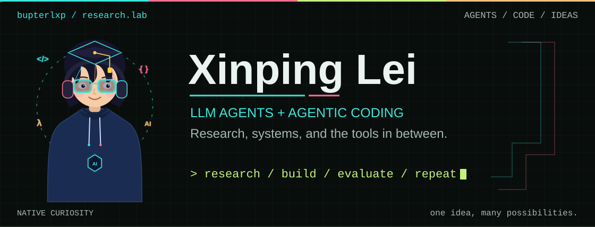
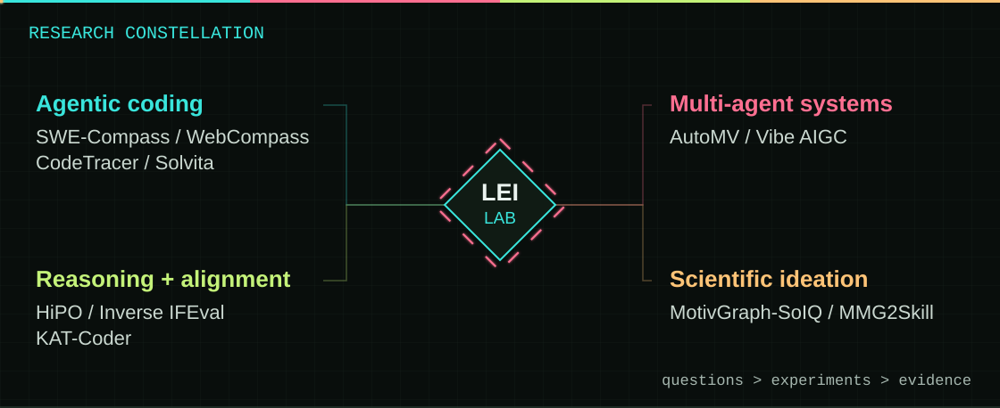

<picture>
  <source media="(max-width: 600px)" srcset="assets/profile/banner-mobile.svg" />
  
</picture>

  <strong>LLM agents · Agentic coding · Research engineering</strong> 
  <a href="https://scholar.google.com/citations?user=8voIL9wAAAAJ&hl=en">Google Scholar</a>
  &nbsp; / &nbsp; <a href="https://arxiv.org/a/lei_x_1">arXiv</a>
  &nbsp; / &nbsp; <a href="mailto:1874493887@qq.com">Email</a>

I work on language-model agents, with an interest in how they plan, follow
instructions, and solve real software tasks. My research spans multi-agent
systems, coding evaluation, reasoning, and scientific idea generation.

## Research

<picture>
  <source media="(max-width: 600px)" srcset="assets/profile/research-mobile.svg" />
  
</picture>

| Focus | Selected work |
| :--- | :--- |
| **Coding agents and evaluation** | [SWE-Compass](https://arxiv.org/abs/2511.05459), [WebCompass](https://arxiv.org/abs/2604.18224), [CodeTracer](https://arxiv.org/abs/2604.11641), [Solvita](https://arxiv.org/abs/2605.15301) |
| **Multi-agent systems** | [AutoMV](https://arxiv.org/abs/2512.12196), [Vibe AIGC](https://arxiv.org/abs/2602.04575) |
| **Reasoning and instruction following** | [HiPO](https://arxiv.org/abs/2509.23967), [Inverse IFEval](https://arxiv.org/abs/2509.04292), [KAT-Coder](https://arxiv.org/abs/2510.18779) |
| **Scientific idea generation** | [MotivGraph-SoIQ](https://scholar.google.com/citations?user=8voIL9wAAAAJ&hl=en), [MMG2Skill](https://arxiv.org/abs/2606.01993) |

## Research Projects

### [ANCHOR](https://github.com/bupterlxp/ANCHOR)

Evaluating whether coding agents follow engineering constraints on modification
scope, workflow order, validation, tool use, and reporting.

358 tasks across 23 repositories and 8 programming languages. The public
repository includes construction and evaluation prompts and the constraint
taxonomy; the evaluation harness is being prepared for release.

[Repository](https://github.com/bupterlxp/ANCHOR)
&nbsp; / &nbsp; [Dataset](https://huggingface.co/datasets/Yone-01/ANCHOR)

### [WebCompass Pipeline](https://github.com/bupterlxp/webcompass_pipeline)

A pipeline for generating, evaluating, and filtering web project code. It
combines instruction checklists, code review, and visual screenshot evaluation.

[Repository](https://github.com/bupterlxp/webcompass_pipeline)
&nbsp; / &nbsp; [Paper](https://arxiv.org/abs/2604.18224)

### [AutoMV](https://arxiv.org/abs/2512.12196)

An automatic multi-agent system for music video generation.

[Paper](https://arxiv.org/abs/2512.12196)
&nbsp; / &nbsp; [Project page source](https://github.com/bupterlxp/AutoMV.github.io)

<strong>Selected publication titles</strong>

- **MotivGraph-SoIQ: Integrating Motivational Knowledge Graphs and Socratic Dialogue for Enhanced LLM Ideation**. Findings of EMNLP 2025. [Scholar](https://scholar.google.com/citations?user=8voIL9wAAAAJ&hl=en)
- **SWE-Compass: Towards Unified Evaluation of Agentic Coding Abilities for LLMs**. [Paper](https://arxiv.org/abs/2511.05459)
- **AutoMV: An Automatic Multi-Agent System for Music Video Generation**. [Paper](https://arxiv.org/abs/2512.12196)
- **Inverse IFEval: Can LLMs Unlearn Stubborn Training Conventions to Follow Real Instructions?** [Paper](https://arxiv.org/abs/2509.04292)
- **HiPO: Hybrid Policy Optimization for Dynamic Reasoning in LLMs**. [Paper](https://arxiv.org/abs/2509.23967)
- **KAT-Coder Technical Report**. [Paper](https://arxiv.org/abs/2510.18779)

[Full publication list on Google Scholar](https://scholar.google.com/citations?user=8voIL9wAAAAJ&hl=en)

## Tools I Build

| Project | What it does |
| :--- | :--- |
| [Math Motion](https://github.com/bupterlxp/math-motion-classroom) | Interactive math lessons, animation previews, and standalone HTML exports for middle school classrooms. |
| [PDF Translate for macOS](https://github.com/bupterlxp/pdf-translate-mac) | A SwiftUI desktop app for PDFMathTranslate, with drag-and-drop translation and preserved layouts. |
| [Feishu × Claude Code](https://github.com/bupterlxp/feishu-claude-code) | A Feishu bot that connects to Claude Code through a configurable API gateway. |
| [Codex Config Manager](https://github.com/bupterlxp/codex-config-manager) | A local web interface for switching authentication and configuration profiles. |
| [Work Planner](https://github.com/bupterlxp/work-planner) | A static PWA with a Kanban board, weekly planning, and AI summaries. |

## Background

- **BUPT** · Beijing University of Posts and Telecommunications.
- **2026 PhD admission** · Joint program at Nanjing University and Zhongguancun Academy (南京大学 × 北京中关村学院).

## Toolbox

   &nbsp;
   &nbsp;
   &nbsp;
   &nbsp;
  

Python · PyTorch · FastAPI · Docker · Git · Linux · LaTeX

<picture>
  <source media="(max-width: 600px)" srcset="assets/profile/terminal-mobile.svg" />
  
</picture>
